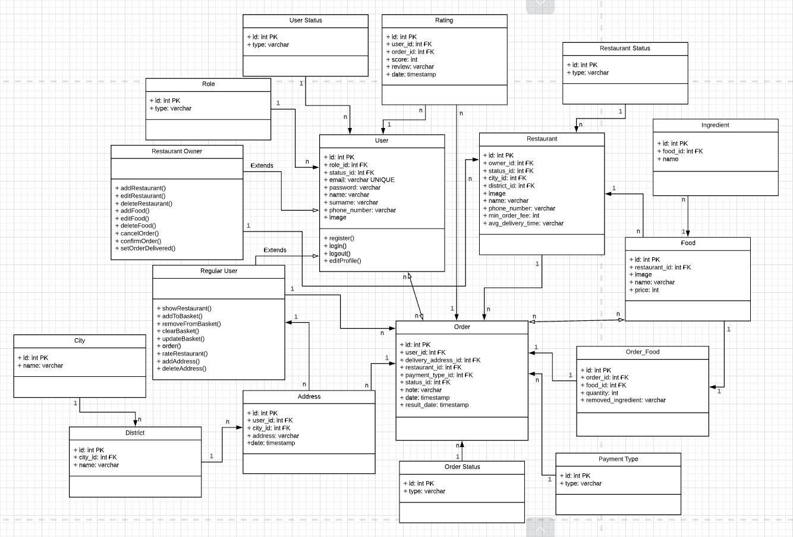

# Yemeksepeti Bootcamp Final Project Server
RESTful API with Node.js for **Yemeksepeti Bootcamp Final Project**, a food ordering application with **Kotlin**

## Libraries
- Node.js
- Express
- Mysql2
- Jsonwebtoken
- Bcrypt
- Dotenv
- Cors

## Database
I used [AWS RDS](https://aws.amazon.com/rds/) for online database (MySQL).

## Base URL
```
https://yemeksepeti-bootcamp-project.herokuapp.com/
```

## Class Diagram


## Responses
#### Success Data Response
```
{
    "success": true,
    "message": "Restaurants listed successfully.",
    "data": [
        {
            "id": 1,
            "city_id": 1,
            "city": "İstanbul",
            "district_id": 23,
            "district": "Kadıköy",
            "image": "https://www.url.com/restaurant.jpg",
            "banner_image": "https://www.url.com/restaurant-banner.jpg",
            "name": "Happy Moon's",
            "phone_number": "4441444",
            "min_order_fee": 50,
            "avg_delivery_time": "35",
            "rating": "4.6667"
        }
    ]
}
```

#### Login Response
```
{
    "success": true,
    "message": "Logged in successfully.",
    "token": "jxjvAWEmxcjv123_jsdf@sdfsadf.jasfj",
    "data": {
        "id": 1,
        "role": "user",
        "email": "yusufgokmen@arisoy.com",
        "name": "Yusuf Gökmen",
        "surname": "Arısoy",
        "image": "1"
    }
}
```

#### Success Response
```
{
    "success": true,
    "message": "Restaurants listed successfully."
}
```

#### Error Response
```
{
    "success": false,
    "message": "No restaurant found."
}
```

## Endpoints
#### Users
```
POST api/users/login
body {
    "email", "password"
}

POST api/users/register
body {
    "email", "password", "name", "surname"
}

GET api/users/profile
header {
    Authorization: token
}

GET api/users/profile/addresses
header {
    Authorization: token
}

GET api/users/profile/orders
header {
    Authorization: token
}

PUT api/users/profile/change-password
header {
    Authorization: token
}
body {
    "current_password", "new_password"
}

PUT api/users/profile/update
header {
    Authorization: token
}
body {
    "email", "password", "name", "surname"
}

POST api/users/profile/addresses/new
header {
    Authorization: token
}
body {
    "title", "district_id", "address"
}

PUT api/users/profile/addresses/{address_id}/update
header {
    Authorization: token
}
body {
    "title", "district_id", "address"
}

DELETE api/users/profile/addresses/{address_id}/delete
header {
    Authorization: token
}
```

#### Restaurants
```
POST api/restaurants/new
header {
    Authorization: token
}
body {
    "city_id", "district_id", "image", "banner_image", "name", "phone_number", "min_order_fee", "avg_delivery_time"
}

GET api/restaurants/{restaurant_id}

GET api/restaurants

GET api/restaurants/most-populars/{city_id}

GET api/restaurants/{restaurant_id}/foods

GET api/restaurants/{restaurant_id}/orders
header {
    Authorization: token
}

PUT api/restaurants/{restaurant_id}/update
header {
    Authorization: token
}
body {
    "city_id", "district_id", "image", "banner_image", "name", "phone_number", "min_order_fee", "avg_delivery_time"
}

PUT api/restaurants/{restaurant_id}/orders/{order_id}/update
header {
    Authorization: token
}
body {
    "status_id"
}

DELETE api/restaurants/{restaurant_id}/delete
header {
    Authorization: token
}
```

#### Restaurant Foods
```
POST api/restaurants/{restaurant_id}/foods/new
header {
    Authorization: token
}
body {
    "image", "name", "price", "ingredients"
}

PUT api/restaurants/{restaurant_id}/foods/{food_id}/update
header {
    Authorization: token
}
body {
    "image", "name", "price", "ingredients"
}

DELETE api/restaurants/{restaurant_id}/foods/{food_id}/delete
```

#### Orders
```
GET api/payment-types

GET api/orders/{order_id}/foods
header {
    Authorization: token
}

POST api/orders/new
header {
    Authorization: token
}

POST api/orders/{id}/foods/add
header {
    Authorization: token
}
body {
    "food_list"
}
```

#### Ratings, Cities and Districts
```
POST api/ratings/new
header {
    Authorization: token
}
body {
    "restaurant_id", "order_id", "score", "review"
}

GET api/ratings

GET api/cities

GET api/districts
```